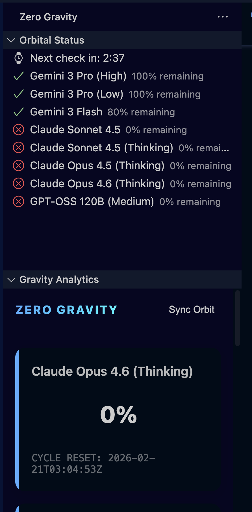
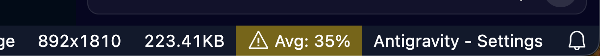

# Zero Gravity

Zero Gravity is a premium VS Code extension designed to monitor and visualize your AI model usage quotas from the Antigravity Language Server in real-time. It provides a high-end dashboard, a detailed orbital status list, and a smart status bar monitor.

## Features

- **Gravity Analytics Dashboard**: A premium, visual dashboard using glassmorphism and SVG progress rings to track your quotas.
- **Orbital Status List**: A detailed tree view showing precise remaining percentages for every model.
- **Smart Status Bar**: A combined monitor in the VS Code status bar showing average usage and warning icons (🚀/⚠️) based on urgency.
- **Real-time Sync**: Automatic refreshing every 5 minutes (configurable) or manual "Sync Orbit" on demand.
- **Direct Access**: Clicking the status bar instantly reveals the analytics panel.

## Installation & Build

To install Zero Gravity locally for development or personal use:

1. **Clone the repository**:
   ```bash
   git clone https://github.com/lablnet/Zero-Gravity
   cd Zero-Gravity
   ```

2. **Install dependencies**:
   ```bash
   npm install
   ```

3. **Compile the extension**:
   ```bash
   npm run compile
   ```

4. **Package the extension (.vsix)**:
   ```bash
   # Generates a .vsix file to install manually in VS Code
   npx @vscode/vsce package --no-git-tag-version
   ```

5. **Install in VS Code**:
   - **GUI Method**: Drag and drop the generated `.vsix` file into your VS Code **Extensions** view, or click the **"..."** (More Actions) button and select **"Install from VSIX..."**.
   - **CLI Method**: Install directly via your terminal:
     ```bash
     code --install-extension zero-gravity-0.0.2.vsix
     ```
     > **Note**: Depending on your system alias, the `code` command might be named differently (e.g., `agy` or `cursor`).
   

## How It Works (Deep Dive)

Zero Gravity works by communicating with the local **Antigravity Language Server** that runs in the background of your editor.

### Core Components:

1.  **Process Discovery (`src/services/quotaService.ts`)**:
    - Scans the system process list (`ps aux`) to find the `language_server`.
    - Extracts the `--csrf_token` from the process arguments to authenticate local requests.
    - Uses `lsof` to detect the exact TCP port the server is listening on.

2.  **Data Retrieval**:
    - Performs a local gRPC-over-HTTP request to `127.0.0.1` using the extracted credentials.
    - Fetches the `clientModelConfigs` which contains the raw quota data.

3.  **Visual Engine (`src/providers/quotaDashboardView.ts`)**:
    - Renders a secure Webview using assets from `src/media/`.
    - **`dashboard.html`**: The UI skeleton.
    - **`dashboard.css`**: Premium styling, gradients, and entrance animations.
    - **`dashboard.js`**: Frontend logic that handles the SVG progress ring math and real-time updates.

4.  **Tree View (`src/providers/quotaTreeView.ts`)**:
    - Manages the sidebar list and the countdown timer logic.

5.  **Status Bar (`src/providers/quotaStatusBar.ts`)**:
    - Aggregates all model data to calculate a "System Average" and updates the VS Code status bar with urgency coloring.

## Configuration

You can customize Zero Gravity in your VS Code settings:
- `zeroGravity.showInStatusBar`: Toggle the bottom-right monitor.
- `zeroGravity.refreshInterval`: Set how often (in minutes) sensors should sync with the server.

## Screenshots

<p align="center">
  
  
</p>

## License

MIT License - See the [LICENSE](./LICENSE) file for details.
